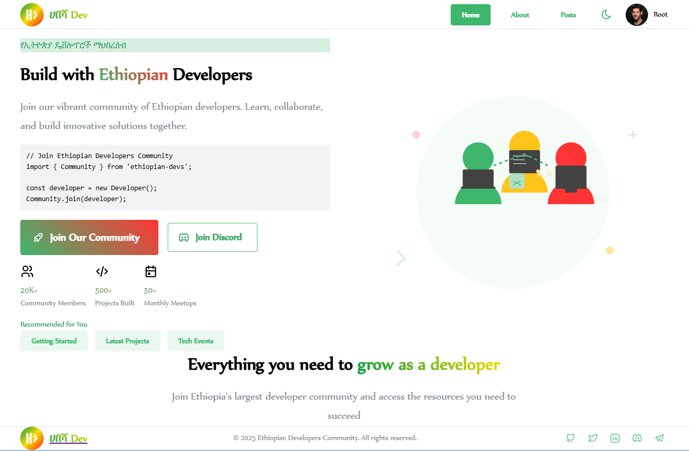
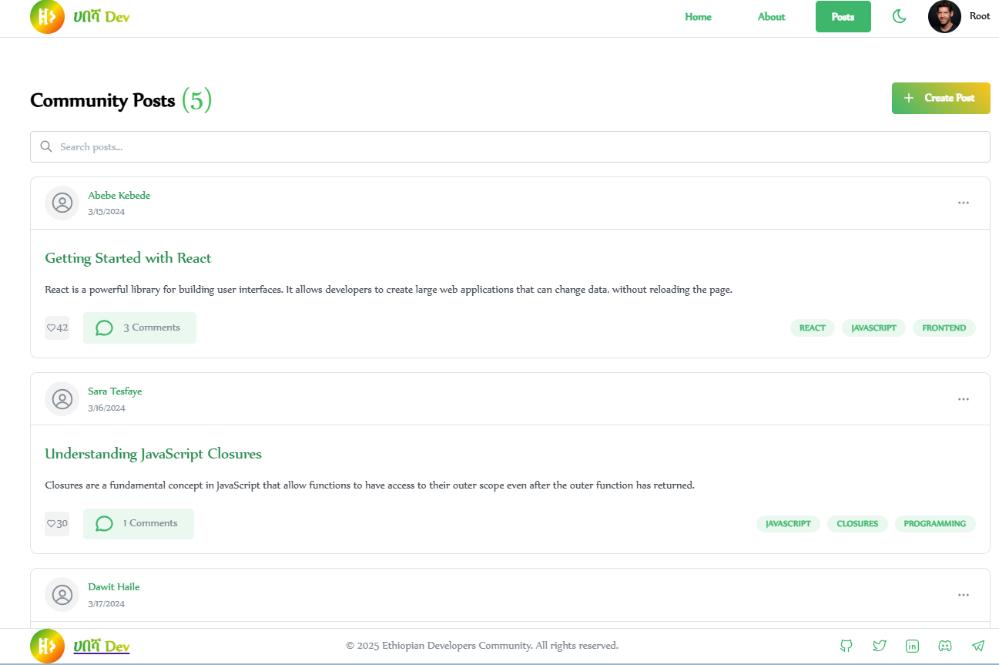
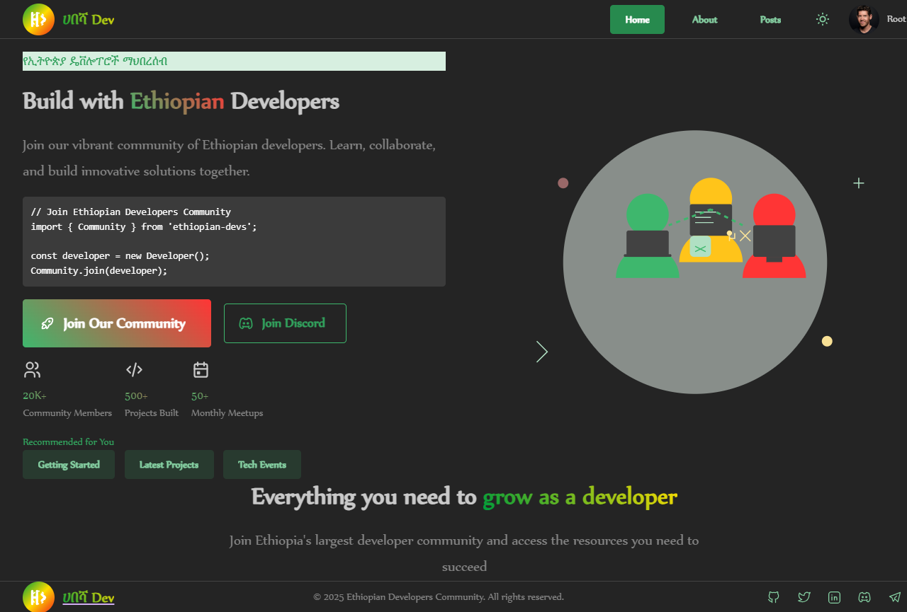

## Overview

This project is a web application that allows users to create and manage their profiles. Users can update their personal information, including their name, email, bio, and profile picture. The application is built using React and Mantine for the UI components.

## Features

- User authentication (if implemented)
- Create and update user profiles
- Upload profile pictures
- Input fields for name, email, and bio
- Tag selection for interests or skills
- Responsive design using Mantine components
- Notifications for user actions

## Technologies Used

- **React**: A JavaScript library for building user interfaces.
- **Mantine**: A React component library for building responsive and accessible applications.
- **TypeScript**: A typed superset of JavaScript that compiles to plain JavaScript.
- **React Router**: For routing and navigation within the application.

## Installation

1. Clone the repository:

   ```bash
   git clone https://github.com/yourusername/my-profile-project.git
   cd my-profile-project
   ```

2. Install the dependencies:

   ```bash
   npm install
   ```

   or

   ```bash
   yarn install
   ```

3. Start the development server:

   ```bash
   npm start
   ```

   or

   ```bash
   yarn start
   ```

4. Open your browser and navigate to `http://localhost:3000` to view the application.

## Usage

- Navigate to the "My Profile" page to view and edit your profile information.
- Fill in the required fields and click "Update Profile" to save your changes.
- You can upload a profile picture and add tags to describe your interests or skills.

## Contributing

Contributions are welcome! If you have suggestions for improvements or new features, please open an issue or submit a pull request.

1. Fork the repository.
2. Create a new branch (`git checkout -b feature/YourFeature`).
3. Make your changes and commit them (`git commit -m 'Add some feature'`).
4. Push to the branch (`git push origin feature/YourFeature`).
5. Open a pull request.

## License

This project is licensed under the MIT License - see the [LICENSE](LICENSE) file for details.

## Acknowledgments

- [Mantine](https://mantine.dev/) for the UI components.
- [React](https://reactjs.org/) for the framework.
- [TypeScript](https://www.typescriptlang.org/) for type safety. remove paraser etc and change my profile to how to runand how to add images screen shoot to read me 




